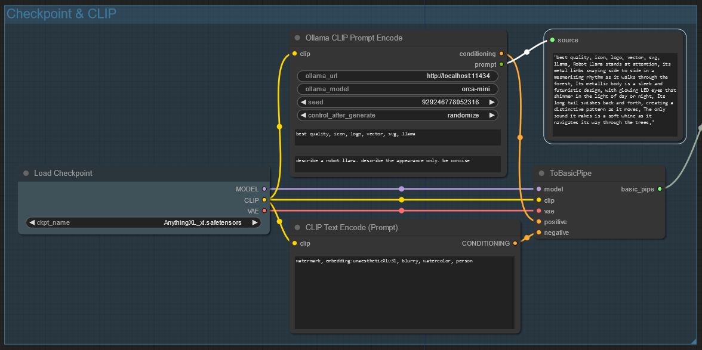
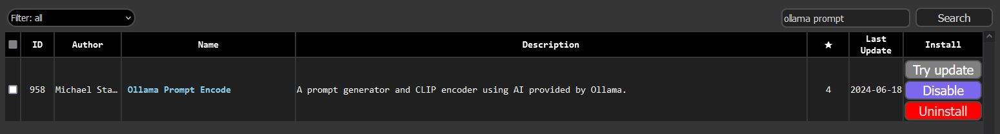

# ComfyUI Ollama Prompt Encode

A prompt generator and CLIP encoder using AI provided by [Ollama](https://ollama.com).



## Prerequisites

Install [Ollama](https://ollama.com) and have the service running.

This node has been tested with ollama version `0.1.42`.

## Installation

Choose one of the following methods to install the node:

### via ComfyUI Manager

If you have the [ComfyUI Manager](https://github.com/ltdrdata/ComfyUI-Manager) installed, you can install the node from the `Install Custom Nodes`.

Search for `Ollama Prompt Encode` and click `Install`.



### via Comfy CLI

If you have the [Comfy CLI](https://github.com/Comfy-Org/comfy-cli) installed, you can install the node from the command line.

```sh
comfy node registry-install comfyui-ollama-prompt-encode
```

The registry instance can be found on (registry.comfy.org)[https://registry.comfy.org/publishers/michaelstanden/nodes/comfyui-ollama-prompt-encode].

### via Git

Clone this repository into your `<comfyui>/custom_nodes` directory.

```sh
cd <comfyui>/custom_nodes
git clone https://github.com/ScreamingHawk/comfyui-ollama-prompt-encode
```

## Usage


The `Ollama CLIP Prompt Encode` node is designed to replace the default `CLIP Text Encode (Prompt)` node. It generates a prompt using the Ollama AI model and then encodes the prompt with CLIP.

The node will output the generated prompt as a `string`. This can be viewed with [rgthree's `Display Any` node](https://github.com/rgthree/rgthree-comfy?tab=readme-ov-file#display-any).

An [example workflow](./docs/ollama_basic_workflow.json) is available in the `docs` folder.

### Ollama URL

The URL to the Ollama service. The default is `http://localhost:11434`.

### Ollama Model

This is the model that is used to generate your prompt.

Some models that work well with this prompt generator are:

- `orca-mini`
- `mistral`
- `tinyllama`

The node will automatically download the model if it is not already present on your system.

Smaller models are recommended for faster generation times.

### Seed

The seed that will be used to generate the prompt. This is useful for generating the same prompt multiple times or ensuring a different prompt is generated each time.

### Prepend Tags

A string that will be prepended to the generated prompt.

This is useful for models like `pony` that work best with extra tags like `score_9, score_8_up`.

### Text

The text that will be used by the AI model to generate the prompt.

## Testing

Run the tests with:

```sh
python -m unittest
```

## Credits

[Michael Standen](https://michael.standen.link)

This software is provided under the [MIT License](https://tldrlegal.com/license/mit-license) so it's free to use so long as you give me credit.
